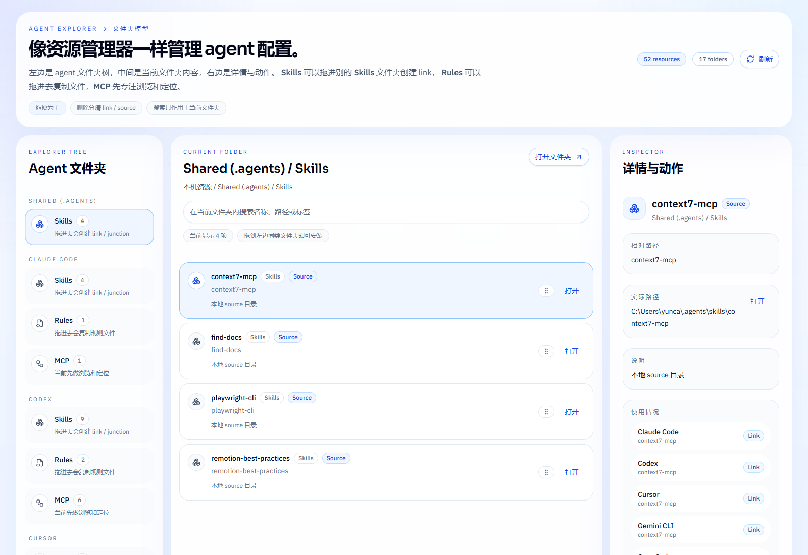

# Agent Config Hub

一个面向本机 AI agent 生态的资源管理器。它把分散在不同客户端、不同目录里的 `skills`、`rules`、`mcp` 拉回到同一个“文件夹模型”里，让你按 agent 和目录直接拖、看、删、定位。



## Why

本机 agent 用久了以后，问题通常不是“有没有配置”，而是：

- 不知道哪些 agent 真正在用什么
- `skills`、`rules`、`mcp` 分散在不同根目录里
- Windows `Junction`、源目录、坏链混在一起，不容易一眼看清
- 要继续扩展更多资源类型时，原来的脚本和零碎命令很难维护

`Agent Config Hub` 的目标不是替代某个单一客户端，而是给整台机器做一层统一的资源管理器。

## What It Does

- 用“一个 agent 一个文件夹”的方式展示 `Skills / Rules / MCP`
- 扫描本机 `skills` 根目录，并区分 `source`、`junction`、`broken-link`
- 扫描本机 `rules` 目录并列出规则文件
- 扫描常见 MCP 配置文件与目录，提取 `mcpServers` / `mcp_servers`
- `Skills` 支持拖到别的 `Skills` 文件夹创建 link / junction
- `Rules` 支持拖到别的 `Rules` 文件夹复制文件
- 支持删除 skill link、删除 source、删除 rule file，并始终显示真实路径
- 支持直接在资源管理器中打开对应本地路径

## Design Direction

- `Explorer-first`：优先贴近 Finder / Explorer 的使用习惯，而不是 dashboard
- `Web-first`：更适合统一看见、快速搜索、继续扩展
- `Server-heavy`：服务端直接读取本机文件系统，客户端专注目录浏览与交互
- `Windows-first`：优先处理本地真实目录结构、配置文件和 `Junction`
- `Extensible`：今天先做 `skills / rules / mcp`，后面继续纳入更多 agent config

## Tech Stack

版本策略：

- 有严格 `LTS` 的运行时，使用最新 `LTS`
- 没有 `LTS` 的库，使用当前稳定版
- 不做没有必要的精确锁死

当前实现：

- `Node.js 24 LTS`
- `Next.js 16`
- `React 19`
- `TypeScript 6`
- `Tailwind CSS 4`
- `shadcn/ui`
- `Radix UI`
- `Lucide`
- `Zod 4`
- `ESLint 9`

这个组合非常适合这种本地资源管理器：

- `Next.js App Router` 负责服务端读取本机资源和提供路由接口
- `React` 负责目录浏览、拖拽和详情面板交互
- `Tailwind CSS 4 + shadcn/ui` 提供更高上限的白蓝资源管理器设计系统
- `Radix UI` 提供无障碍基础能力
- `TypeScript + Zod` 负责静态类型和运行时数据校验

## Current Coverage

当前已经覆盖这几类本地资源：

- `skills`
- `rules`
- `mcp`

其中 `mcp` 扫描会读取常见客户端配置，例如：

- `.claude.json`
- `.cursor/mcp.json`
- `.gemini/settings.json`
- `.config/opencode/opencode.json`
- `.codex/config.toml`

## Project Structure

```text
src/
  app/
    api/
      open/route.ts
      snapshot/route.ts
    globals.css
    layout.tsx
    page.tsx
  components/
    ui/
    config-explorer.tsx
  lib/
    types.ts
    utils.ts
    server/
      powershell.ts
      resource-actions.ts
      scan-mcp.ts
      scan-rules.ts
      scan-skills.ts
      shared.ts
      snapshot.ts
public/
  screenshots/
    agent-config-hub-explorer-v1.png
```

## Local Development

安装依赖：

```powershell
npm install
```

启动开发：

```powershell
npm run dev
```

Windows 一键启动生产版：

```powershell
.\scripts\start-agent-config-hub.cmd
```

可选自定义端口：

```powershell
.\scripts\start-agent-config-hub.cmd 3005
```

生产构建：

```powershell
npm run build
```

代码检查：

```powershell
npm run lint
```

## Notes

- 这是一个本地运行的资源管理器，不是云端多用户平台
- 当前设计明显偏向 Windows 本机环境
- 后续可以继续扩展到更多 agent 资源类型，而不只是 `skills`
